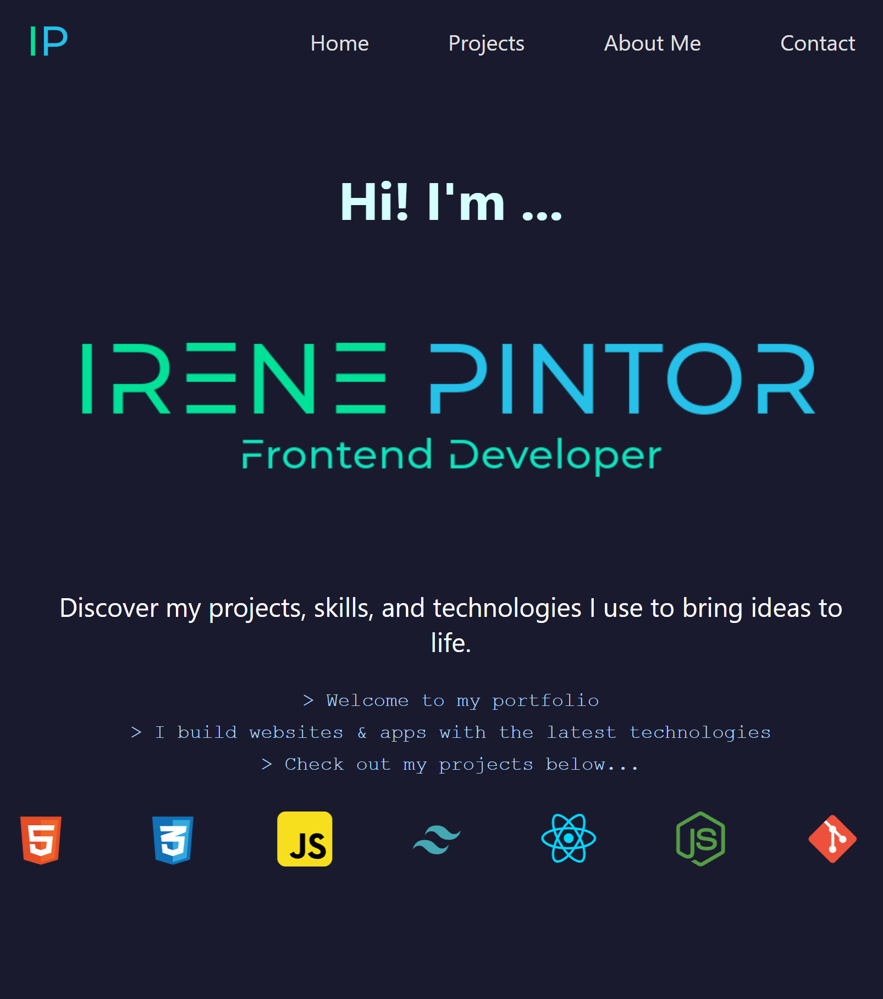

# Portfolio

This is my personal portfolio website, showcasing my skills, projects, and experience as a Frontend Developer. Built with Astro.js, Tailwind CSS, and JavaScript, the site is responsive and features smooth animations and a tech stack section that highlights the tools I use.

## Features

- **Responsive Design**: Optimized for both mobile and desktop views.
- **Typing Animation**: Introduces the site with a typewriter effect to engage visitors.
- **Tech Stack**: Displays the technologies I work with in a sliding animation.
- **Work Experience Timeline**: A vertical timeline highlighting my work history, updated via a JSON file.

## Technologies Used

- **Astro.js**
- **Tailwind CSS**
- **JavaScript (Vanilla)**

## How to Use

1. Clone this repository:
    ```bash
    git clone https://github.com/irenepintor/irene-dev.git
    ```
2. Navigate to the project directory:
    ```bash
    cd portfolio
    ```
3. Install the dependencies:
    ```bash
    npm install
    ```
4. Run the development server:
    ```bash
    npm run dev
    ```

## Future Enhancements

- Adding a Spanish version of the site.
- Removing the dark mode toggle (currently unused).
- Incorporating more interactive elements in the portfolio.

## Images


